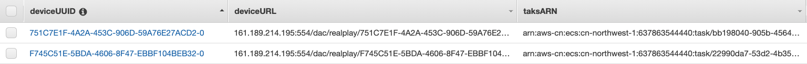

# Hikvision媒体网关设计文档 v1.0
| 日期  | 版本  | 修订历史  | 状态  |
| ------------ | ------------ | ------------ | ------------ |
| 2020/7/28  | v1.0  | 产品架构，部署步骤  | 待审核（易珂）  |
|   |   |   |

- [Hikvision媒体网关设计文档 v1.0](#hikvision媒体网关设计文档-v10)
  - [前提条件](#前提条件)
    - [AWS账号（以国内服务为例）](#aws账号以国内服务为例)
    - [AMI](#ami)
    - [容器镜像（以国内服务为例）](#容器镜像以国内服务为例)
  - [整体架构](#整体架构)
    - [媒体网关配置](#媒体网关配置)
    - [设备状态维护](#设备状态维护)
    - [ECS集群](#ecs集群)
    - [健康检查](#健康检查)
  - [开始部署（以国内服务为例）](#开始部署以国内服务为例)
    - [CDK版本 (推荐)](#cdk版本-推荐)
    - [Python版本 (暂时废弃)](#python版本-暂时废弃)

## 前提条件
### AWS账号（以国内服务为例）
建议您安装[AWS Shell](https://github.com/awslabs/aws-shell)或者[AWS CLI](https://docs.aws.amazon.com/cli/latest/userguide/cli-chap-install.html)并设置相应的Access Key和Secret Key。
或者您也可以直接创建~/.aws/credentials，添加如下内容：
```json
[default]
aws_access_key_id = YOUR_ACCESS_KEY
aws_secret_access_key = YOUR_SECRET_KEY
```
之后创建~/.aws/config，添加如下内容：
```json
[default]
region=cn-northwest-1
```

### AMI
您需要获取到对应的AMI然后利用AWS export等工具导入到您的账户当中，导入时将您的AMI Name设置为Hikvision，您会在EC2的IMAGES-AMIs选项中看到对应的AMI。
其中AMI基于标准版Window10作为基线，有以下改动：
* 安装python3，aws cli作为后续脚本执行的基础环境；
* 安装了postman，vs code作为调试工具
* 添加python执行路径到powershell的环境变量（$PROFILE.AllUsersAllHosts）
* 设置windows定时任务执行cron.py（默认15分钟间隔）
* 设置ec2config启动时执行curl.py（仅启动执行一次）

### 容器镜像（以国内服务为例）
该容器镜像主要负责设备上线后的视频流拉取，转码和存储，通过AWS ECS集群的Fargate特性实现资源的无服务器化部署，实现资源的无缝扩容，降低了集群的运维管理成本。镜像的打包以及向docker registry（AWS ECR）的上传通过如下命令实现：
```shell
# cd ip-camera/docker-build/
# docker build -t videohandler .
# docker tag videohandler <account id>.dkr.ecr.cn-northwest-1.amazonaws.com.cn/ip-camera
# aws ecr get-login-password --region cn-northwest-1 | docker login --username AWS --password-stdin  <account id>.dkr.ecr.cn-northwest-1.amazonaws.com.cn
# 如果上条命令因为命令行版本问题无法执行，可以执行
# aws ecr get-login | awk -F' ' '{print $6}' | docker login --username AWS --password-stdin  <account id>.dkr.ecr.cn-northwest-1.amazonaws.com.cn
# docker push <account id>.dkr.ecr.cn-northwest-1.amazonaws.com.cn/ip-camera
```

## 整体架构
整体方案通过CDK实现所有服务的创建，部署和管理，利用IaC（infrastructure as code）实现基础设施的代码化管理，保障任一区域，任一账号，任一时间部署的基础服务完全一致，高度可用，运维简单。如下图所示，EC2实例中包含Hikvison的媒体网关软件，CDK部署完毕后该实例自动如网关名称，密码，网络等配置，待用户添加摄像头设备并上线后，后台进程会自动获取设备对应的流媒体URL并维护到DynamoDB数据库，同时触发后端RCS集群进行视频流的转码和存储，存储进S3桶中的视频流在超过配置的天数后会自动转存到S3 Galacier以更低的成本实现存储。


### 媒体网关配置
AMI中curl.py的功能如下，主要是进行网关软件启动后的自动化配置：
* 通过传入参数Password修改网关密码，
* 通过传入参数GatewayName修改网关名称
* 通过传入参数Timezone修改网关时区
* 通过传入参数ElasticIP配置网关网络，包括NAT中的：Enable Platform Port Mapping and External IP/Port config; Enable Device Port Mapping and External IP/Port config；

内部逻辑如下图所示：


### 设备状态维护
AMI中cron.py的功能如下，结合windows自身的任务计划程序（默认每15分钟），维护媒体设备状态并将其对应的媒体流URL固化到数据库，以触发对应的后端容器集群进行转码和存储：
* 检测上线设备并将该设备对应的媒体流URL写入DynamoDB数据库
* 检测下线设备并将该设备从DynamoDB数据库中老化删除
* 检测用户手动删除设备并将该设备从DynamoDB数据库中老化删除

内部逻辑如下图所示：


设备状态维护状态机如下图所示：


所有的设备状态固化在DynamoDB中（deviceMediaURL），其中主键为deviceIndex，排序键为channel，容为mediaURL，如下图所示：


ECS运行状态维护在DynamoDB中（ip-camera），其中主键为deviceIndex，内容为deviceURL和taskARN，如下图所示：


### ECS集群
后端的ECS集群我们采用了Fargate方式来实现容器实例的自动管理，基本架构如下:


当前Fargate架构可以支持Spot模式进一步降低部署的成本，需要注意Fargate暂不支持GPU能力，可以结合业务需要修改成EC2模式

### 健康检查
目前的健康检查细分成三部分的异常处理，分别是摄像头设备，媒体网关，ECS任务，其对应的异常状态和对应的方案如下：

```html
网关：故障—被动reboot——ECS中ffmpeg任务循环执行
     主动reboot————|

设备：网络短暂掉线———|
     网络持续掉线———|
     主动reboot————|—ECS中ffmpeg任务循环执行
     7764端口未收流—|

ECS：任务状态故障监测—通过ECS-EventBridge-SNS上报

EC2：实例故障检测-通过CloudWatch Event-Lambda-Snapshot-实例恢复和销毁

```
前两种的解决方案利用ffmpeg自动重连和循环来实现摄像头设备和网关设备造成的媒体流中断或者丢失。ECS集群的故障检测通过结合EventBridge实现初步的事件上报，后期考虑任务的重建。EC2实例的故障检测通过CloudWatch Event实现定时触发Lambda来查询媒体网关软件提供的API和AWS SDK（boto3）提供的EC2 API实现健康状态检查，并分级分别实现媒体网关软件的重启和EC2 Snapshot的恢复。后者包括1）根据用户提供的RTO和RPO实现对应时间间隔Snapshot的创建；2）新实例的创建以及原弹性IP绑定；3）原错误状态实例的销毁。

服务调用的基本架构如下，分别包括媒体网关软件和EC2的定时健康状态的检测，Snapshot的创建：


媒体网关软件和EC2健康检查逻辑如下：


## 开始部署（以国内服务为例）
### CDK版本 (推荐)
通过CDK实现一键命令部署所有的服务，包括EC2，VPC，DynamoDB，ECS，SSM，S3等所有资源，具体的资源通过vs code中的AWS CDK EXPLORER插件或者CDK部署时的输出可以查看：


利用CDK版本我们输出对应的CloudFormation模版，同时通过cdk deploy命令实现一键部署。你可以选择安装[AWS CDK](https://docs.aws.amazon.com/cdk/latest/guide/getting_started.html#getting_started_install)，然后直接将代码clone到本地执行，或者直接将提供的CloudFormation模版导入到您AWS CloudFormation服务中点击自动部署。
```shell
查看当前的stack
# cdk ls

初始化对应的asset存放的S3
# cdk bootstrap

输出对应的CloudFormation模版
# cdk synth --no-staging > template.yaml

部署到指定的区域和账号
# export CDK_DEPLOY_ACCOUNT=7xxx-xxxx-xxx2
# export CDK_DEPLOY_REGION=cn-northwest-1
```

```shell
设置参数进行部署，其中
* GatewayName为启动的媒体网关名称，默认是Hikvision；
* Timezone为启动的媒体网关所在时区，默认是8，即UTC+08:00；
* Password为启动的媒体网关密码，默认是Hikvision@AWS，密码通过AWS SSM实现安全存储和传输；
* Password为媒体网关所在EC2的机型，默认是c5.xlarge；
* ElasticIP为媒体网关所在EC2的弹性IP，该弹性IP保障客户对外服务为该固定IP地址，不论EC2实例重启还是终结；
* Segment为视频流在ECS中的分割执行时间，默认是30秒；
* BucketTransition为在S3标准桶中的视频流转存到S3 Glacier的门限天数，默认是7天；
部署命令参考如下
# cdk deploy --force --parameters GatewayName='AaronAWS' --parameters Timezone='8' --parameters Password='Aws@Hikvision' --parameters MachineType='c5.xlarge' --parameters ElasticIP='x.x.x.x' --parameters Segment='600' --parameters BucketTransition=14
```
执行过程中可以相应通过屏幕上的输出获取相应的执行状态，执行完毕后我们可以看到类似的输出如下：


通过登陆相应的aws console可以查看到对应数量的ec2实例启动，点击connect选项下载相应的rdp文件连接启动远程实例，登陆界面用户名保持不变（administrator），密码输入**win10@aws**，新版本是**Aws@2016**

登陆进去界面后打开浏览器输入私网IP地址（默认创建的子网地址是11.0.x.x）将可以见到对应的Hikvison的用户界面，此时输入您CDK部署时设置的Password，登陆后可以查看到对应媒体网关的名称，时区和网络都已经自动设置完毕，此时添加摄像头设备，会自动触发视频流的转码，存储服务。

### Python版本 (暂时废弃)
执行python命令，输入对应选项信息，其中-g/p/t选项携带进user data
```shell
$ python HikEx.py -e 1.2.3.4 -m c5.xlarge -n 2 -g awsAaron -p Hik@Aaron -t 12
$ python HikEx.py -h
INFO:botocore.credentials:Found credentials in shared credentials file: ~/.aws/credentials
Usage: HikEx.py [-e] [-m] [-n] [-g] [-p] [-t]
Options:
  --version             show program's version number and exit
  -h, --help            show this help message and exit
  -e IP address, --elasticIP=IP address
                        elastic IP address
  -m EC2 type, --machineType=EC2 type
                        EC2 type to select
  -n EC2 number, --number=EC2 number
                        EC2 number to select
  -g file name, --gatewayName=file name
                        custom gateway name
  -p password string, --password=password string
                        user input password
  -t timezone offset (e.g. 8 for UTC+8:00), --timezone=timezone offset (e.g. 8 for UTC+8:00)
                        local timezone
```

该脚本执行如下功能：
* 创建EIP，EC2携带user data拉起并绑定到该EIP
* 创建S3，并创建对应的instance profile

EC2拉起后user data自动执行curl.py，包括如下功能
* 修改网关密码，通过curl.py的-p选项传入
* 修改网关名称，通过curl.py的-g选项传入
* 修改网关时区，通过curl.py的-t选项传入
* 修改网关网络，NAT中的：Enable Platform Port Mapping and External IP/Port config; Enable Device Port Mapping and External IP/Port config；